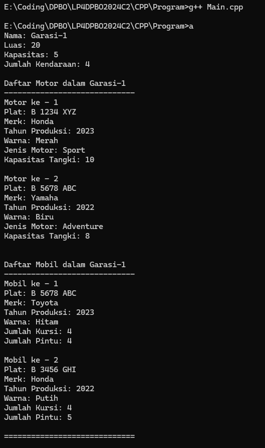
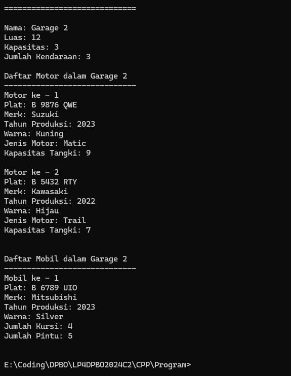

# LP4DPBO2024C2

## Janji
Saya Muhamad Tio Ariyanto [2201718] mengerjakan soal Latihan Praktikum 4
dalam mata kuliah DPBO untuk keberkahanNya saya tidak melakukan kecurangan
seperti yang telah dispesifikasikan. Aamiin

## Deskripsi Program
Buatlah program berbasis OOP menggunakan bahasa pemrograman C++ dan Python  yang mengimplementasikan konsep inheritance, composition, dan array of object pada kelas-kelas berikut :

- Vehicle : plat nomor, merk, tahun produksi, warna
- Car : jumlah kursi, jumlah pintu
- Motorcycle : jenis motor, kapasitas tangki
- Garage : nama garasi, luas garasi, daftar kendaraan
- ParkingLot : kapasitas, jumlah kendaraan saat ini

## Desain Program

## Penjelasan Desain Program

## Dokumentasi
### Dokumentasi CPP

