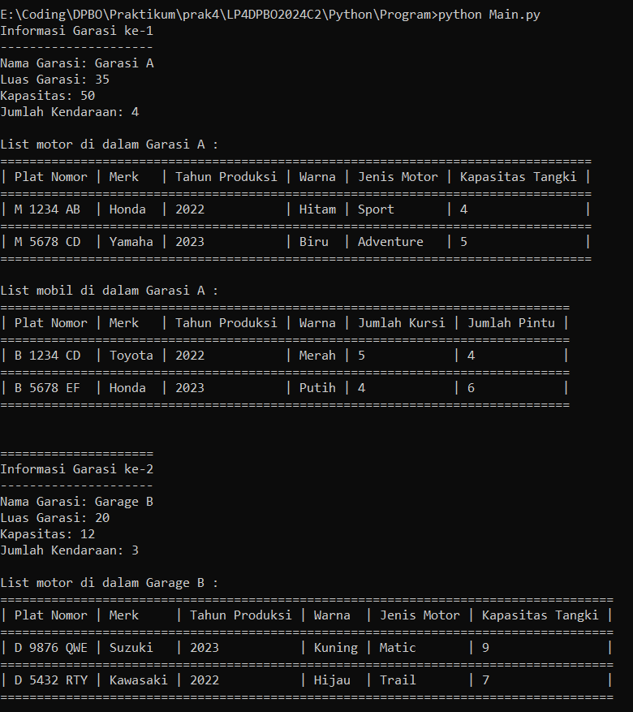

# LP4DPBO2024C2

## Janji
Saya Muhamad Tio Ariyanto [2201718] mengerjakan soal Latihan Praktikum 4
dalam mata kuliah DPBO untuk keberkahanNya saya tidak melakukan kecurangan
seperti yang telah dispesifikasikan. Aamiin

## Deskripsi Program
Buatlah program berbasis OOP menggunakan bahasa pemrograman C++ dan Python  yang mengimplementasikan konsep inheritance, composition, dan array of object pada kelas-kelas berikut :

- Vehicle : plat nomor, merk, tahun produksi, warna
- Car : jumlah kursi, jumlah pintu
- Motorcycle : jenis motor, kapasitas tangki
- Garage : nama garasi, luas garasi, daftar kendaraan
- ParkingLot : kapasitas, jumlah kendaraan saat ini

## Desain Program

## Penjelasan Desain Program
Program terdiri dari 5 kelas, yaitu kelas Vehicle, Car, Motorcycle, Garage, dan ParkingLot. Disini, kelas Car dan Motorcycle merupakan jenis yang sama yaitu Vehicle, sehingga kedua kelas tersebut menjadi anak dari kelas Vehicle dan mewarisi atribut-atribut dari kelas Vehicle. Sementara untuk kelas Garage merupakan anak dari kelas ParkingLot. Untuk alasan mengapa kelas Garage merupakan anak dari kelas ParkingLot yaitu karena keduanya merupakan jenis yang sama yaitu sebagai tempat parkir, disini kelas Garage sendiri merupakan salah satu dari jenis ParkingLot. Dengan dijadikannya kelas Garage sebagai anak dari kelas ParkingLot membuat kelas Garage dapat mewarisi atribut dan metode dari kelas ParkingLot yang relevan dengan kelas Garage, sambil menambahkan atribut dan metode tambahan yang spesifik untuk kelas Garage (dalam kasus ini yaitu luas_garasi, dan daftar_kendaraan yang disimpan di dalamnya.)

## Dokumentasi
### Dokumentasi CPP

### Dokumentasi Python

